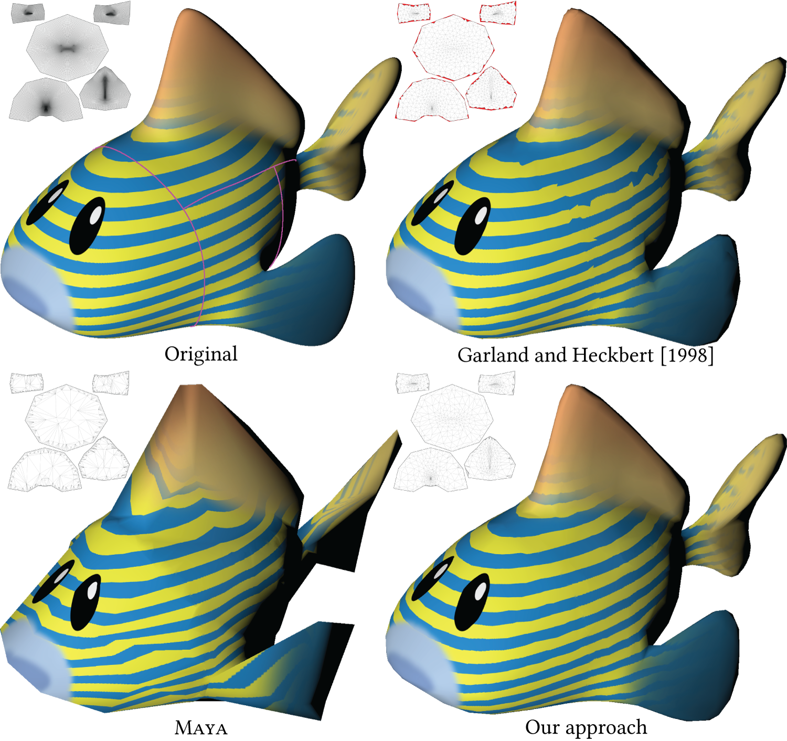
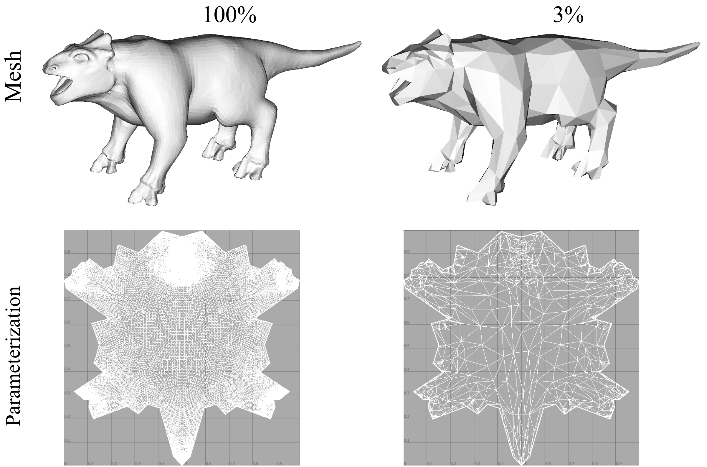
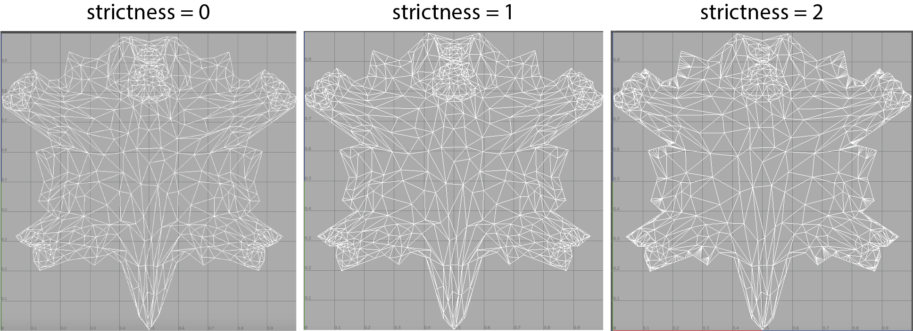

# Seam-aware Decimater

This project implements the seam-aware decimation portion of our SIGGRAPH Asia 2017 paper 
[Seamless: Seam erasure and seam-aware decoupling of shape from mesh resolution](https://cragl.cs.gmu.edu/seamless/).
Seam-aware decimater simplifies a mesh while preserving its UV's boundary. It allows 
the same texture to be used across all decimation levels—notably along seams.

Our seam-aware decimation allows seamless texture reuse at all decimation levels (here, approximately 1%). Seams on the original model are shown in
purple. Parameterizations are shown inset. [Garland and Heckbert [1998]](http://dl.acm.org/citation.cfm?id=288280) (implemented by MeshLab [Cignoni et al. 2008]) do not preserve seams precisely,
leading to artifacts in the texture. Red areas near seams in the inset parameterization indicate this deviation in the parametric domain. [Maya [2017]](http://www.autodesk.com/maya) prevents
decimation of seams entirely, leading to suboptimal allocation of mesh vertices.	
	

### Requirements

This project uses C++ 11, and it depends on:

- [libigl](https://github.com/libigl/libigl) (`git clone https://github.com/libigl/libigl.git --recursive`)
- [eigen](http://eigen.tuxfamily.org/) (e.g. `brew install eigen`)

### Compile this project
    mkdir build
    cd build
    cmake -DCMAKE_BUILD_TYPE=Release ..
    make
    
### Run this project
	./decimater ../models/animal.obj percent-vertices 50
	./decimater ../models/animal.obj num-vertices 1000

   Note: this library only works on triangle mesh.
   
### Various strictness

Seamless criteria is even stricter than UV shape preservation. I add a "strictness" parameter to satisfy different requirements. Strictness could be 0, 1, or 2.
Strictness 0 means no UV shape is preserved, but UV parameters is still part of the metrics. 
Strictness 1 means UV shape is preserved. 
Strictness 2 means seam aware decimation which also considers the length ratio criteria. It works like this:

###	
	./decimater ../models/animal.obj percent-vertices 50 --strict 1
	./decimater ../models/animal.obj num-vertices 1000 --strict 1
	
The default strictness is 2.

### Example
The Animal model is decimated to 3% of its original number of vertices. The boundary of its UV parameterization stays.
	
	
